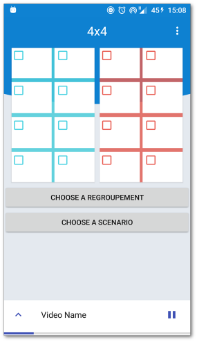
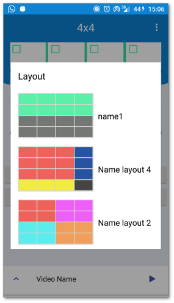
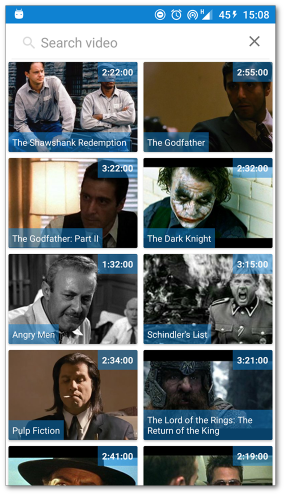
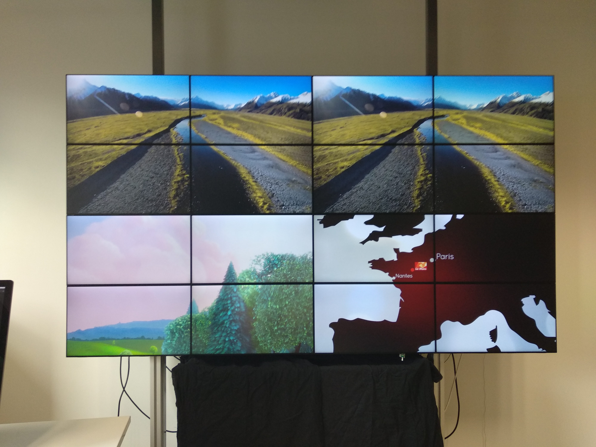

 SmartWallRemote [Download APK](app/build/outputs/apk/debug)
==

:iphone: A remote control to interact with a wall of screens.

### [Report](./rapport/report.pdf)

> A wall of images is capable of projecting different scenarios of video animations.  
> A scenario is based on the definition of a certain number of videos and their positioning on the wall of images.

	
	
	

	

