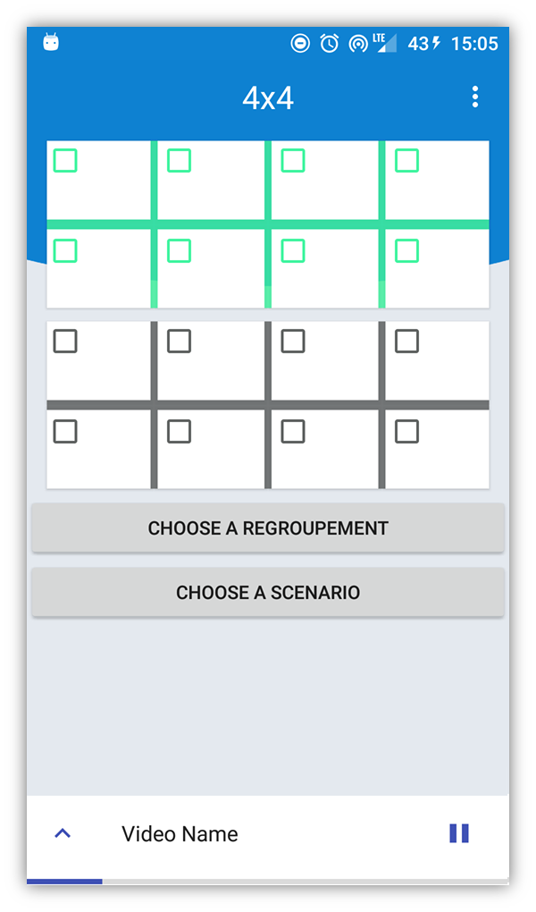

 SmartWallRemote [Download APK](app/build/outputs/apk/debug)
==

:iphone: A remote control to interact with a wall of images.

> A wall of images is capable of projecting different scenarios of video animations.
> A scenario is based on the definition of a certain number of videos and their positioning on the wall of images.

  

